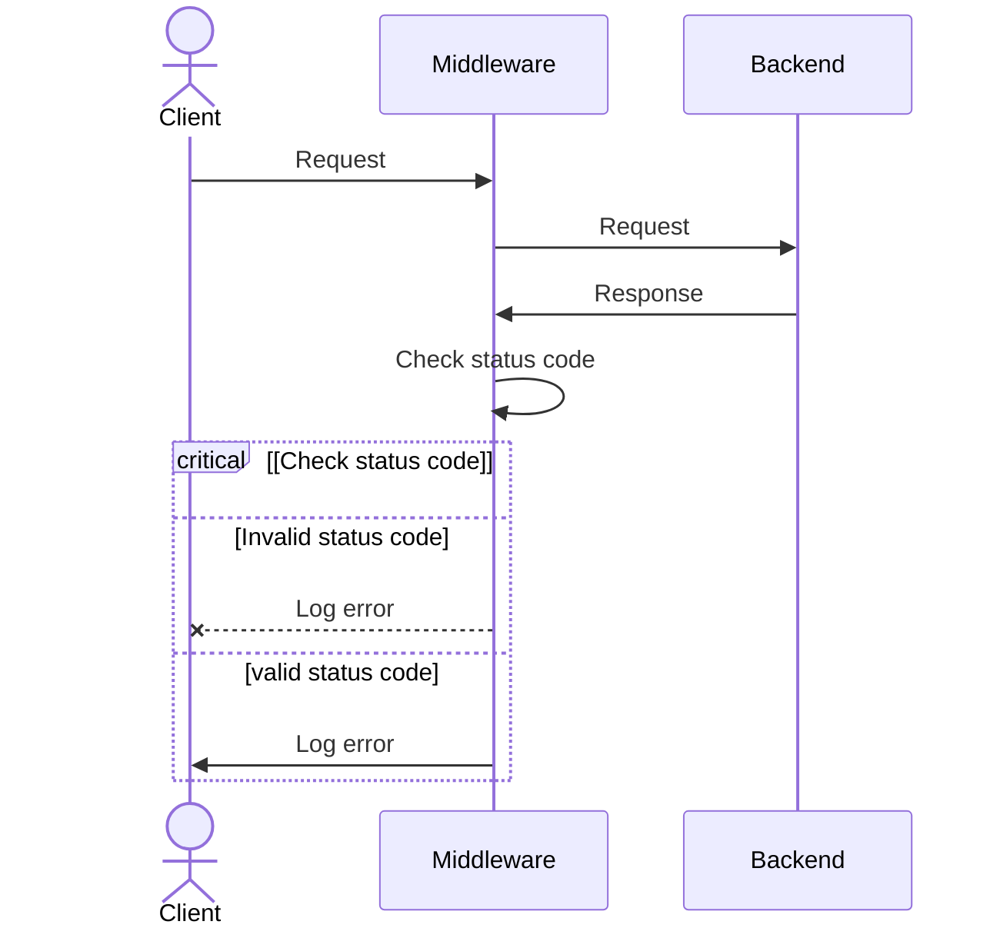

# Fail2ban plugin for traefik

[](https://github.com/tomMoulard/fail2ban/actions/workflows/main.yml)

This plugin is an implementation of a Fail2ban instance as a middleware
plugin for Traefik.

## Middleware

After installing the plugin, it can be configured through a Middleware, e.g.:

```yml
apiVersion: traefik.io/v1alpha1
kind: Middleware
metadata:
  name: fail2ban-test
spec:
  plugin:
    fail2ban:
      logLevel: DEBUG
      denylist:
        ip: 127.0.0.1
```

<details>
<summary>Add the middleware to an ingressroute</summary>

```yml
apiVersion: traefik.io/v1alpha1
kind: IngressRoute
metadata:
  name: simplecrd
  namespace: default
spec:
  entryPoints:
    - web
  routes:
  - match: Host(`fail2ban.localhost`)
    kind: Rule
    middlewares:
    - name: fail2ban-test
    services:
    ...
```

</details>

## Configuration

Please note that the allowlist and denylist functionality described below can
_only_ be used _concurrently_ with Fail2ban functionality (if you are looking
for a way to allowlist or denylist IPs without using any of the Fail2ban
logic, you might want to use a different plugin.)

### Allowlist
You can allowlist some IP using this:
```yml
testData:
  allowlist:
    files:
      - "tests/test-ipfile.txt"
    ip:
      - "::1"
      - "127.0.0.1"
```

Where you can use some IP in an array of files or directly in the
configuration.

If you have a single IP, this: `ip: 127.0.0.1` should also work.

### Denylist
Like allowlist, you can denylist some IP using this:
```yml
testData:
  denylist:
    files:
      - "tests/test-ipfile.txt"
    ip:
      - "::1"
      - "127.0.0.1"
```

Where you can use some IP in an array of files or directly in the
configuration.

Please note that Fail2ban logs will _only_ be visible when Traefik's log level
is set to `DEBUG`.

## Fail2ban
We plan to use all default fail2ban configuration but at this time only a
few features are implemented:
```yml
testData:
  rules:
    urlregexps:
    - regexp: "/no"
      mode: block
    - regexp: "/yes"
      mode: allow
    bantime: "3h"
    findtime: "10m"
    maxretry: 4
    enabled: true
    statuscode: "400,401,403-499"
```

Where:
 - `findtime`: is the time slot used to count requests (if there is too many
requests with the same ip in this slot of time, the ip goes into ban). You can
use 'smart' strings: "4h", "2m", "1s", ...
 - `bantime`: correspond to the amount of time the IP is in Ban mode.
 - `maxretry`: number of request before Ban mode.
 - `enabled`: allow to enable or disable the plugin (must be set to `true` to
enable the plugin).
 - `urlregexp`: a regexp list to block / allow requests with regexps on the url
 - `statuscode`: a comma separated list of status code (or range of status
codes) to consider as a failed request.

#### URL Regexp
Urlregexp are used to defined witch part of your website will be either
allowed, blocked or filtered :
- allow : all requests where the url match the regexp will be forwarded to the
backend without any check
- block : all requests where the url match the regexp will be stopped

##### No definitions

```yml
testData:
  rules: {}
```

By default, fail2ban will be applied.

##### Multiple definition

```yml
testData:
  rules:
    urlregexps:
    - regexp: "/whoami"
      mode: allow
    - regexp: "/do-not-access"
      mode: block
```

In the case where you define multiple regexp on the same url, the order of
process will be :
1. Block
2. Allow

In this example, all requests to `/do-not-access` will be denied and all
requests to `/whoami` will be allowed without any fail2ban interaction.

#### Status code
When this configuration is set (i.e., `statuscode` is not empty), the plugin
will wait for the request to be completed and check the status code of the
response. If the status code is in the list of status codes, the request will
be considered as a failed request.

Note that the request is considered completed when the response is back sent to the
plugin, therefore, the request went through the middleware, traefik, to the backend,
and back to the middleware.

<details>
<summary>Here is a little schema to explain the process</summary>



</details>

#### Schema
First request, IP is added to the Pool, and the `findtime` timer is started:
```
A |------------->
  ↑
```

Second request, `findtime` is not yet finished thus the request is fine:
```
A |--x---------->
     ↑
```

Third request, `maxretry` is now full, this request is fine but the next wont.
```
A |--x--x------->
        ↑
```

Fourth request, too bad, now it's jail time, next request will go through after
`bantime`:
```
A |--x--x--x---->
           ↓
B          |------------->
```

Fifth request, the IP is in Ban mode, nothing happen:
```
A |--x--x--x---->
B          |--x---------->
              ↑
```

Last request, the `bantime` is now over, another `findtime` is started:
```
A |--x--x--x---->            |------------->
                             ↑
B          |--x---------->
```

## How to dev

```bash
$ docker compose up
```

# Authors
| Tom Moulard | Clément David | Martin Huvelle | Alexandre Bossut-Lasry |
|-------------|---------------|----------------|------------------------|
|[](https://tom.moulard.org)|[](https://github.com/cledavid)|[](https://github.com/nitra-mfs)|[](https://www.linkedin.com/in/alexandre-bossut-lasry/)|
